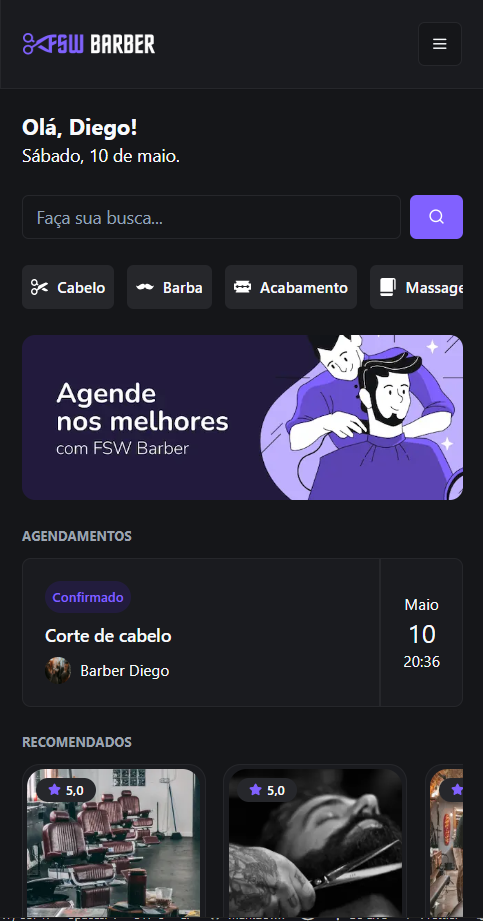
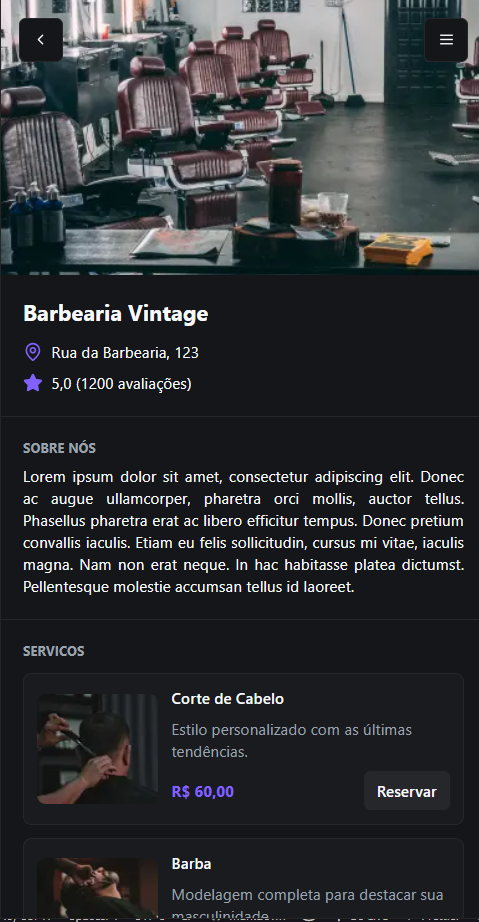

# Barbershop Project

Aplicação web para cadastro e gerenciamento de barbearias e seus serviços, desenvolvida com Next.js, TypeScript e React. Este projeto foi criado ao longo de um evento chamado FSW Barber, conduzido pelo instrutor Felipe Mota Rocha.

## 🚀 Tecnologias Utilizadas

- Next.js
- React
- TypeScript
- Tailwind CSS
- Prisma ORM
- PostgreSQL


## 💡 Funcionalidades

- Cadastro de barbearias
- Login com Google
- Gerenciamento de serviços oferecidos
- Agendamento de Serviços
- Listagem de barbearias e seus respectivos serviços
- Interface responsiva e moderna

## ⚙️ Como Executar o Projeto

1. Clone o repositório:

   ```bash
    git clone https://github.com/DigoCast/barbershop-project.git
    cd barbershop-project
   ```
2. Instale as dependências:
   ```bash
    npm install
    # ou
    yarn install
   ```
3. Configure o banco de dados com o Prisma:
   ```bash
    npx prisma migrate dev
   ```
4. Inicie o servidor de desenvolvimento:
   ```bash
    npm run dev
    # ou
    yarn dev
   ```
5. Acesse a aplicação em http://localhost:3000

### Demonstracao:
<p align="center">
  
  
</p>